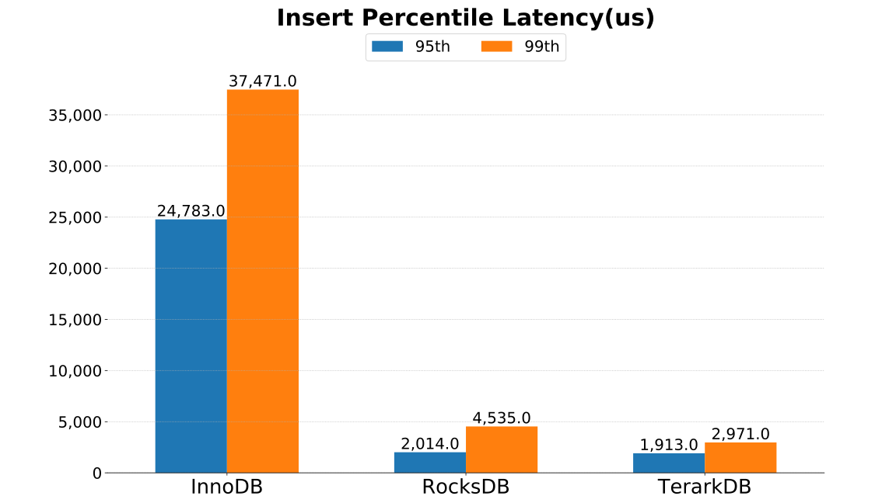
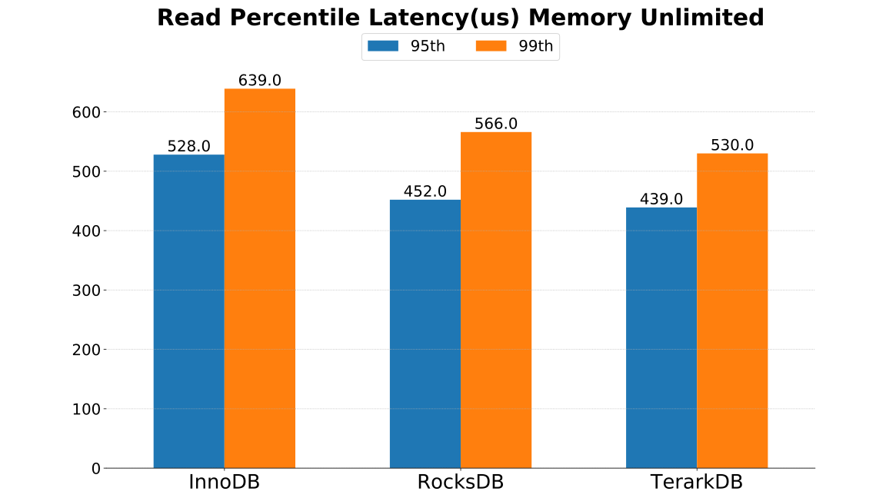
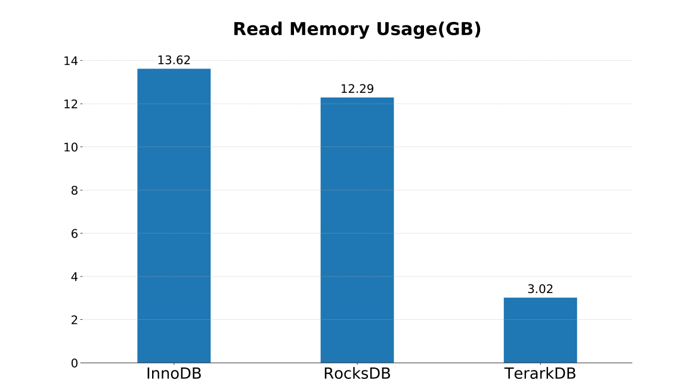
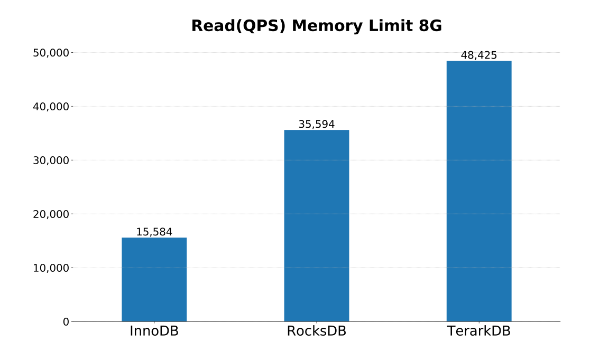
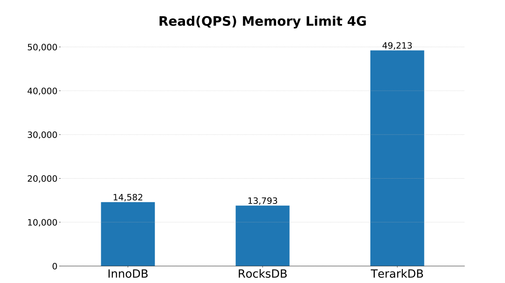
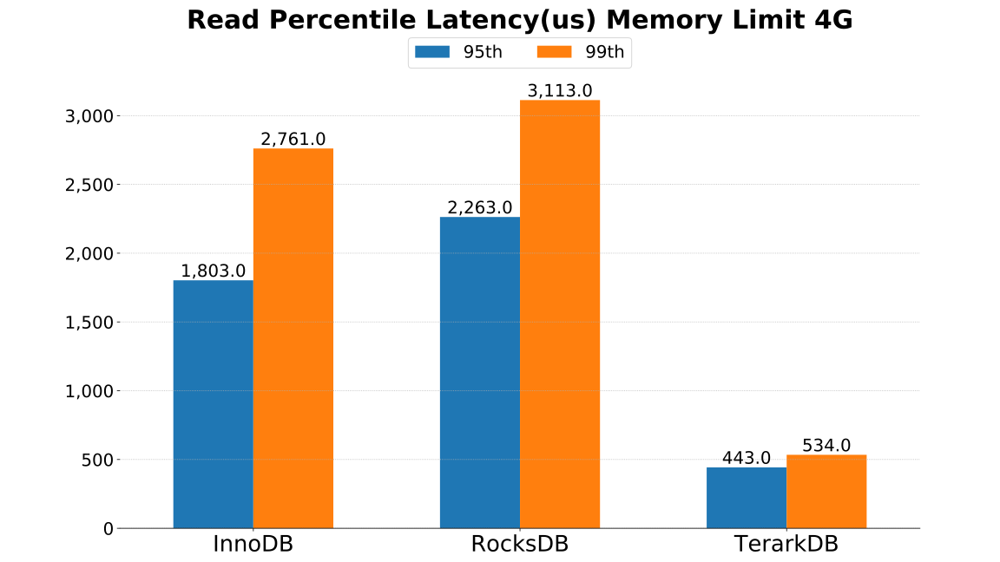
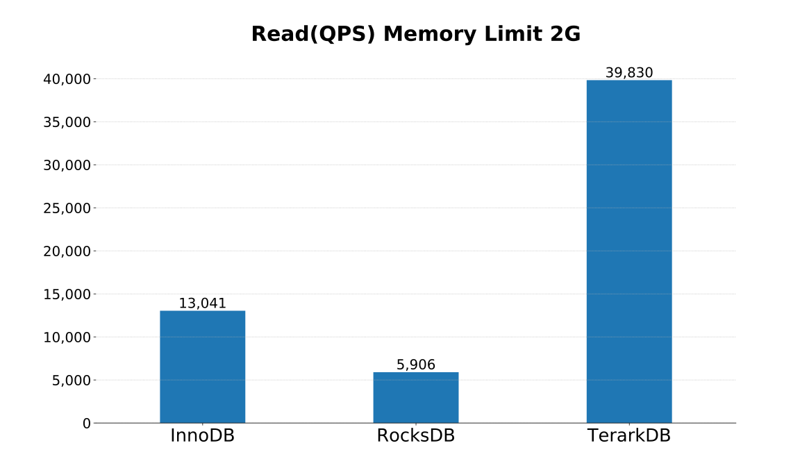
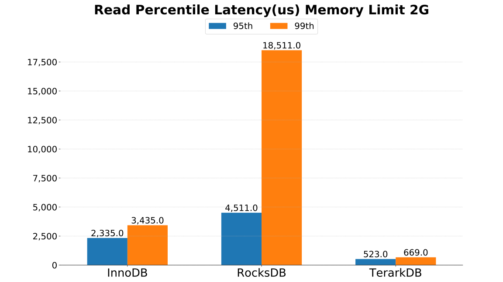

## Amazon Movie Reviews 测试

### 目录
- 1.前言
- 2.测试方式
  - 2.1.测试平台
- 3.写性能
- 4.压缩率
- 5.读性能
  - 5.1.数据远小于内存（内存 64GB）
  - 5.2.数据略小于内存（内存 8GB）
  - 5.3.数据略大于内存（内存 4GB）
  - 5.4.数据远大于内存（内存 2GB）

### 1.前言
[TerarkSQL](https://github.com/Terark/mysql-on-terarkdb) 是使用 [TerarkDB](https://github.com/Terark/terarkdb)(替换了 SSTable 的 RocksDB) 作为存储引擎的 MySQL。

[MyRocks](https://github.com/facebook/mysql-5.6) 是使用了 [RocksDB](https://github.com/facebook/rocksdb) 作为存储引擎的 MySQL，我们通过 MyRocks 将 TerarkDB 集成进入 MySQL。

### 2.测试方式
- 测试工具
  - YCSB([https://github.com/Terark/YCSB-mongo](https://github.com/Terark/YCSB-mongo))
- 测试数据
  - 由于 YCSB 的数据都是纯随机字符串生成的，离用户的真实场景相差较大
  - 所以我们修改了 YCSB，让它可以使用 [Amazon movie data (~8 million reviews)](https://snap.stanford.edu/data/web-Movies.html) 数据进行测试
- 测试数据集尺寸
  - 原始数据约 9.1GB，数据清洗后约 8G
  - 约 800万条数据
  - 平均每条数据大约 1KB
- 测试使用的引擎
  - MySQL + InnoDB，以下简称 InnoDB
  - [MySQL on RocksDB](https://github.com/facebook/mysql-5.6)，使用 RocksDB 作为存储引擎（即 MyRocks），以下简称 RocksDB
  - [TerarkSQL](https://github.com/Terark/mysql-on-terarkdb)，使用 TerarkDB 作为存储引擎，以下简称 TerarkDB
- 读性能测试均是**均匀分布**与**齐普夫（Zipf）分布**测试
- 这里记录了读测试 95/99 分位延迟数据

#### 2.1.测试平台

- CPU: Intel(R) Xeon(R) CPU E5-2630 v3 @ 2.40GHz x2 （共16核32线程）
- 内存: DDR4 16G @ 1866 MHz x4 （共64G）
- SSD: INTEL 730 IOPS 89000
- 操作系统: CentOS 7

### 3.写性能
- 以下为**写入速度**：

- 写 **95/99 分位**延迟：

### 4.压缩率
原数据集约为 9.1GB，一共约 800万条数据，平均每条数据大约 1KB。
- 磁盘空间占用如下：

### 5.读性能

#### 5.1.基本设置
- 内存限制使用 cgroups 达成
- 测试客户端均在内网的其他服务器运行(使用千兆交换机连接)
- 所有的读测试使用 16 线程，每一线程启动一个连接
- InnoDB 使用默认配置选项
  - 因为 InnoDB 使用文件 IO 接口读取文件，cgroups 无法限制系统缓存，所以使用内核参数限制内存
- RocksDB 启用 `allow_mmap_reads` 选项，以便使用 cgroups 限制内存，BlockSize 为 16k
- TerarkDB 使用默认配置选项（TerarkDB 默认启用 `allow_mmap_reads`）

所有的读测试均分为**均匀分布**与**齐普夫（zipf）分布**。

#### 5.2.数据远小于内存（内存 64GB）
- 此时不限制内存，系统内存为 64GB
- RocksDB 的 `block_cache_size` 设为默认值(系统内存的一半)
- 读 95/99 分位延迟数据为均匀分布测试结果

- 如下为 64G内存下各引擎读测试的内存占用

#### 5.3.数据略小于内存（内存 8GB）
- 此时使用 cgroups 限制内存为 8G
- 测试 InnoDB 时限制系统内存为 8.6G，除去系统占用，MySQL 所能使用内存约为 8G
- RocksDB 的 `block_cache_size` 设置为 2G
- TerarkDB 需要的内存只有 3.02G，远小于 8G，不影响性能
- 读95/99分位延迟数据为均匀分布测试结果

#### 5.4.数据略大于内存（内存 4GB）
- 此时限制内存为 4G
- 测试 InnoDB 时限制系统内存为 4.6G，除去系统占用，MySQL 所能使用的内存约为 4G
- RocksDB 的 `block_cache_size` 设置为 1G
- TerarkDB 需要的内存只有 3.02G，小于 4G，不影响性能
- 读95/99分位延迟数据为均匀分布测试结果

#### 5.5.数据大于内存（内存 2GB）
- 此时限制内存为 2G
- 测试 InnoDB 时限制系统内存为 2.6G，除去系统占用，MySQL 所能使用的内存约为 2G
- RocksDB 的 `block_cache_size` 设置为 500M
- 此种情况下 RocksDB 和 InnoDB 都达不到需要的内存，瓶颈在于文件 IO，速度严重下降。 TerarkDB 因将数据压缩至 2.5G，和内存大小相差不大，仍然保持较好的性能
- 读 95/99 分位延迟数据为均匀分布测试结果

